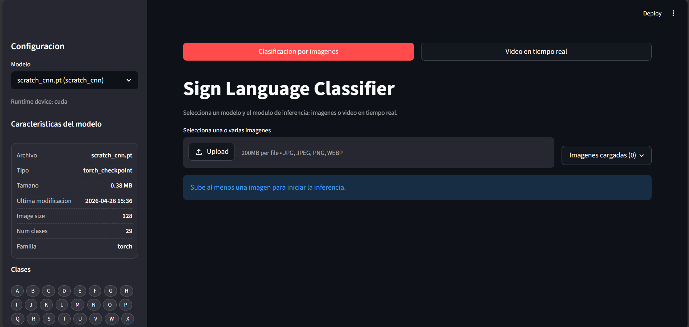
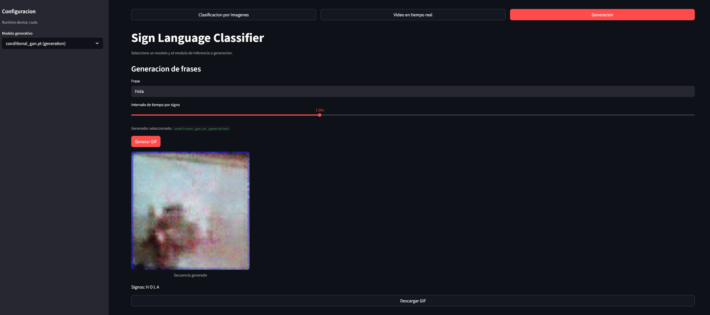

# signlanguage-classifier

**URL del proyecto:** 

[](https://github.com/AleComan/signlanguage-classifier)

Base project for sign language image classification and generation with four pipelines:

1. Classical ML baseline (deep features + scikit-learn classifier).
2. CNN trained from scratch (without pretrained weights).
3. Fine-tuning of a pretrained model (configurable partial freezing).
4. Conditional ASL generation (`Class -> Image`) with cGAN and sentence-to-GIF sequencing.

## Table of Contents

- [Project structure](#project-structure)
- [ASL Alphabet dataset](#asl-alphabet-dataset)
- [Requirements](#requirements)
- [Environment (Conda)](#environment-conda)
- [Environment variables](#environment-variables)
- [Running pipelines (notebooks)](#running-pipelines-notebooks)
- [ASL generative pipeline](#asl-generative-pipeline)
- [Experimental results](#experimental-results)
  - [Model comparison table](#model-comparison-table)
  - [ML baseline results](#ml-baseline-result)
- [Conclusions (Accuracy, Overfitting, and Deployment)](#conclusions-accuracy-overfitting-and-deployment)
  - [1) Which model has the best accuracy?](#1-which-model-has-the-best-accuracy)
  - [2) Does it generalize well, or is it overfitted?](#2-does-it-generalize-well-or-is-it-overfitted)
  - [3) Would we deploy it to production now?](#3-would-we-deploy-it-to-production-now)
- [Streamlit interface](#streamlit-interface)
  - [Running the Streamlit app](#running-the-streamlit-app)
  - [Recommended workflow](#recommended-workflow)
- [Project authors](#-project-authors)

## Project Structure

```text
signlanguage-classifier/
|-- app/
|   `-- streamlit_app.py
|-- configs/
|   |-- baseline_ml.yaml
|   |-- dataset_asl.yaml
|   |-- finetune.yaml
|   |-- generation.yaml
|   `-- scratch_cnn.yaml
|-- notebooks/
|   |-- 01_eda.ipynb
|   |-- 02_baseline_ml.ipynb
|   |-- 03_scratch_cnn.ipynb
|   |-- 04_finetune.ipynb
|   `-- 05_generation_train.ipynb
|-- scripts/
|   `-- prepare_dataset.py
|-- src/
|   |-- data/
|   |-- eda/
|   |-- evaluation/
|   |-- features/
|   |-- inference/
|   |-- models/
|   |-- training/
|   `-- utils/
|-- tests/
|-- README.md
|-- TASKS.md
`-- requirements.txt
```

## ASL Alphabet Dataset

The dataset used is **ASL Alphabet** ([American Sign Language](https://www.kaggle.com/datasets/grassknoted/asl-alphabet)), a collection of images designed for classifying hand gestures from the American Sign Language alphabet. 

The dataset contains 29 classes in total:
- **26 letters** (A-Z).
- **3 special classes:** *SPACE* (space), *DELETE* (delete), and *NOTHING* (no gesture, empty background).

An example of the images in the dataset is shown below:

Example: 


Expected structure of the main raw dataset:

```text
data/asl_alphabet_v1/raw/
`-- asl_alphabet_train/
    |-- A/
    |-- B/
    |-- ...
    |-- del/
    |-- nothing/
    `-- space/
```

Preprocessed into `ImageFolder` format with a stratified split by class:

```bash
conda activate DL; python scripts/prepare_dataset.py --config configs/dataset_asl.yaml
```

Generated output:
- `data/asl_alphabet_v1/processed/train|val/<label>/...`
- `data/asl_alphabet_v1/processed/metadata.csv`
- `data/asl_alphabet_v1/processed/summary.json`

Notes:
- `del` is automatically renamed to `delete` (configurable in `configs/dataset_asl.yaml`).
- The default split is 85/15 from `asl_alphabet_train`.
- Real-world evaluation was carried out using personal photos or webcam input, outside the train/val split.

## Requirements

- Python 3.10+ recommended.
- Dataset processed using the `torchvision` `ImageFolder` structure:

```text
data/
|-- train/
|   |-- class_a/
|   `-- class_b/
`-- val/
    |-- class_a/
    `-- class_b/
```

## Environment (Conda)

```bash
conda activate DL
```

This repository assumes that you already have the dependencies installed in your `DL` environment.
`requirements.txt` is maintained as a reference for reproducibility.

## Environment Variables

1. Create a `.env` file in the project root.
2. Set the required variables.

Example:

```env
WANDB_API_KEY=your_api_key
WANDB_ENTITY=your_username_or_team
WANDB_PROJECT=signlanguage-classifier
# Optional: default discriminative model in Streamlit
MODEL_PATH=artifacts/baseline_ml/baseline_model.joblib
# Optional: default generator for the Generation tab
GENERATOR_MODEL_PATH=artifacts/generation/conditional_gan.pt
```

## Running Pipelines (Notebooks)

Launch Jupyter from the project root so that the notebooks can automatically import `src/`:

```bash
conda activate DL; jupyter lab
```

Available notebooks in `notebooks/`:

- `01_eda.ipynb` - dataset exploration (classes, sizes, color, samples).
- `02_baseline_ml.ipynb` - ResNet18 features + sklearn classifiers (LogReg, SVM, RF) and comparison.
- `03_scratch_cnn.ipynb` - `SimpleCNN` trained from scratch with curves and final evaluation.
- `04_finetune.ipynb` - ResNet18 fine-tuning with partial freezing and discriminative LRs.
- `05_generation_train.ipynb` - Conditional cGAN, sample visualization, and `sentence -> GIF` test.

Each notebook reads its YAML configuration from `configs/`, stores artifacts in `artifacts/<pipeline>/`, and, if `tracking.use_wandb` is enabled and `WANDB_API_KEY` is available, logs metrics to Weights & Biases.

Common artifacts:
- `artifacts/baseline_ml/baseline_model.joblib` (ML baseline with scaler + class_names).
- Torch checkpoints in `artifacts/...` (`.pt`, `.pth`, `.ckpt`) for the deep learning pipelines.
- `artifacts/generation/conditional_gan.pt` (conditional ASL generator).
- `artifacts/generation/samples/epoch_XXXX.png` (samples with fixed noise for visual inspection).

## ASL Generative Pipeline

The project includes a generic inversion of the discriminative workflow:

```text
ASL Class -> Conditional cGAN -> Synthetic Image
Sentence -> ASL tokens -> frames -> GIF
```

Supported classes:
- `A` a `Z`
- `delete`
- `nothing`
- `space`

These classes match the output of `scripts/prepare_dataset.py`, including the `del` -> `delete` rename.

CLI training:

```bash
conda activate DL; python -m src.training.gan_trainer --config configs/generation.yaml
```

You can also use `notebooks/05_generation_train.ipynb`, which documents the pipeline step by step:
- reading `configs/generation.yaml`,
- checking the processed dataset,
- visualizing a real batch,
- optional overrides for quick tests,
- cGAN training,
- reviewing generated samples,
- testing the `generate_phrase_sequence()` engine.

Tracking:
- W&B logs `generator_loss`, `discriminator_loss`, and generated samples with fixed noise.
- `configs/generation.yaml` includes a `metrics` block to optionally enable Inception Score and FID.
- Generative metrics are disabled by default because they are slower and may require InceptionV3 weights from `torchvision`.

Generative inference:
- `src/inference/generator.py` exposes `generate_phrase_sequence(phrase, frame_duration)`.
- The function tokenizes character by character, ignores unsupported symbols, and converts spaces to the `space` class.
- If a generative checkpoint exists, it generates images with the cGAN.
- If no checkpoint exists, it uses dataset images as a fallback and, as a last resort, deterministic placeholder frames.

## Experimental Results

### Model Comparison Table

[](https://wandb.ai/adne-image-classification/image-classification)

> **Methodological Note:** To maximize the amount of training data, we strategically decided to forgo a classic *test split* from the original dataset. Instead, generalization capability has been validated qualitatively and empirically through direct testing in the application with personal images, evaluating the model from scratch against real-world conditions (lighting variations, different resolutions, etc.). 
> 
> The following table shows the best models considering all dimensions. In addition to *accuracy*, the selection is supported by advanced metrics (F1-score, Recall, Precision) monitored in Weights & Biases to ensure balanced performance across all classes. Runtime and epoch counts vary to ensure proper convergence of each architecture.

| Model / Run | Family | Val Accuracy | Train Accuracy | Gap (train-val) | Val F1-Score | Runtime |
| :--- | :--- | :---: | :---: | :---: | :---: | :---: |
| `finetune-resnet18` (10 epochs) | Transfer learning (ResNet18) | **0.9986** | 0.9987 | +0.0001 | 0.9985 | 10152 s (~169 min) |
| `scratch-cnn-trial-03-10-epochs` | CNN from scratch | 0.9955 | 0.9968 | +0.0014 | 0.9955 | 4698 s (~78 min) |
| `baseline-ml` (RF on deep features) | Classical ML + deep features | 0.9955 | N/D | N/D | 0.9956 | 959 s (~16 min) |
| `scratch-cnn-trial-03` (base config, 8 epochs) | CNN from scratch | 0.9881 | 0.9491 | -0.039 | 0.9881 | 3093 s (~51 min) |

### ML Baseline Result

In `baseline-ml`, the best candidate was `random_forest`:

- `random_forest`: val_accuracy = 0.9955 (val_f1_macro = 0.9956)
- `logistic_regression`: val_accuracy = 0.9728
- `linear_svc`: val_accuracy = 0.9629

## Conclusions (Accuracy, Overfitting, and Deployment)

### 1) Which model has the best accuracy?
The best model is **`finetune-resnet18`** with **`0.9986`** validation *accuracy*. 
It stands out as the best candidate because it has undergone the most extensive empirical testing at the application level, demonstrating superior performance on real-world images.

### 2) Does it generalize well or is it overfitted?
In the *fine-tuning* run, the `train-val` difference is only `~0.0001`, which is minimal. This suggests **excellent fit within the available split** and shows no numerical signs of *overfitting*. 

Although no formal external *test* set was used, this decision was made to maximize the use of available training data. Real-world generalization was qualitatively validated by passing personal images through the application, confirming that the model performs surprisingly well under changes in lighting, backgrounds, and resolution.

### 3) Would we deploy it to production now?
**Yes, but only within a controlled environment and as an initial candidate.**

Putting a model into production is not only a matter of *accuracy*, but also of technical feasibility and system requirements. 

Reasons to proceed cautiously:
- **Hardware and Power Constraints:** `finetune-resnet18` is a relatively heavy architecture. If the final application requires execution on low-power devices (Edge AI) or minimal real-time latency, it would be necessary to evaluate whether the device can support it without compromising the user experience (battery life, heat).
- **Lightweight alternatives:** If hardware requirements are strict, the `baseline-ml` (such as a Random Forest) could be the necessary alternative at the cost of sacrificing some accuracy.

Practical recommendation: Start deploying `finetune-resnet18` in a controlled manner (beta phase or closed environment) while monitoring its impact on application performance and system resources.

#### **Recommended next steps for the production environment:**
1. **Primary Deployment:** Integrate the final version of `finetune-resnet18` as the application's primary classification engine.
2. **Low-Latency Alternative:** Keep the `baseline-ml` (Random Forest) documented as a fallback model in case future updates require much faster inference or lower computational cost on less powerful devices.
3. **Continuous Improvement Loop (Data Flywheel):** Now that the model is in the app, we are considering enabling a feature that allows users to report when the model makes a mistake. These real-world "hard images" could be captured and added to the dataset to continue retraining and improving the model in the future.

## Streamlit Interface

The application (`app/streamlit_app.py`) centralizes discriminative inference and conditional generation. It has three main modes:

1. **Image Classification** (batch)
2. **Real-Time Video** (webcam, if `streamlit-webrtc` is available)
3. **Generation** (sentence -> ASL sequence -> GIF)

The sidebar displays a different model selector depending on the mode:

- In **Image Classification** and **Real-Time Video**, only discriminative models (`.joblib`, `.pt`, `.pth`, `.ckpt`) compatible with `src/inference/predict.py` are shown.
- In **Generation**, only generative checkpoints with `model_type == "conditional_gan"`, compatible with `src/inference/generator.py`, are shown.
- The app remembers the last selected discriminative and generative models separately, so switching tabs does not lose the previous selection.



<!-- Placeholder for the second screenshot:
     Save the Generation tab image as docs/StreamlitGeneration.png
     and leave the following line active. -->


## Running the Streamlit App

```bash
conda activate DL; streamlit run app/streamlit_app.py
```

The app allows you to:
- select discriminative models for image or video classification,
- select generative models to produce ASL sequences from text,
- view discriminative model information in the sidebar,
- upload one or more images and obtain top-k predictions (up to top-5),
- clear uploaded images with a dedicated button,
- write a sentence in `Generation`, adjust the duration per sign between `0.5s` and `2.0s`,
- view the generated GIF and download it.

Notes:
- If `MODEL_PATH` exists in `.env`, it is used as the default discriminative option.
- If `GENERATOR_MODEL_PATH` exists in `.env`, the `Generation` tab uses that checkpoint.
- If no generative checkpoint is available, the `Generation` tab uses dataset/placeholders as a fallback so it can continue working.
- If no discriminative models are detected in `artifacts/`, the app indicates this with an explicit message.

### Recommended Workflow

1. Start the app:
   ```bash
   conda activate DL; streamlit run app/streamlit_app.py
   ```
2. In **Image Classification** or **Real-Time Video**, select a discriminative model in the sidebar.
3. In **Image Classification**, upload one or more images (drag & drop or file selector).
4. The app displays:
   - top-k table per image,
   - top-5 thumbnails,
   - average batch confidence,
   - batch accuracy/error **only** when the ground-truth label can be inferred from the filename.
5. In **Generation**, select a generative checkpoint, enter a sentence, and generate the GIF.
6. When returning to another tab, the app keeps the last selection for each model family.

## 👥 Project Authors

This project was developed by:

* **Alejandro Torres Martínez** - [GitHub](https://github.com/alejandrotm22) | [LinkedIn](https://www.linkedin.com/in/alejandro-torres-martinez-b65490301/)
* **Alejandro Coman Venceslá** -  [GitHub](https://github.com/AleComan) | [LinkedIn](https://www.linkedin.com/in/aleecv/)
